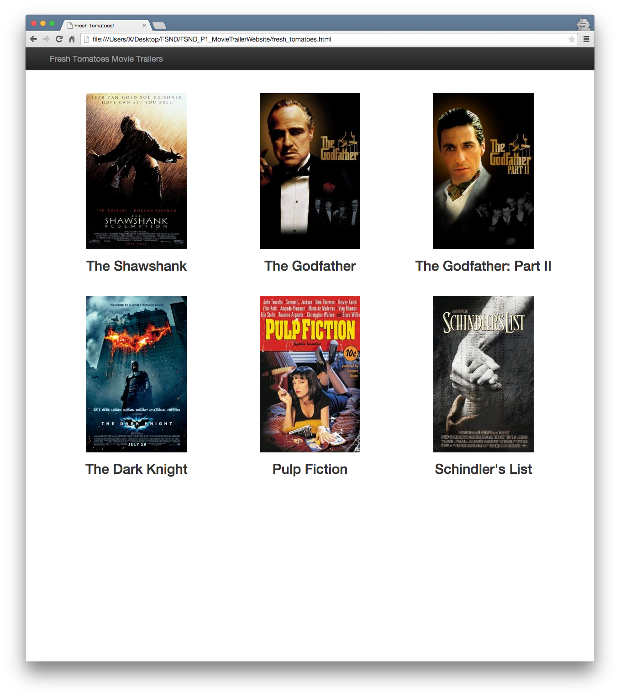
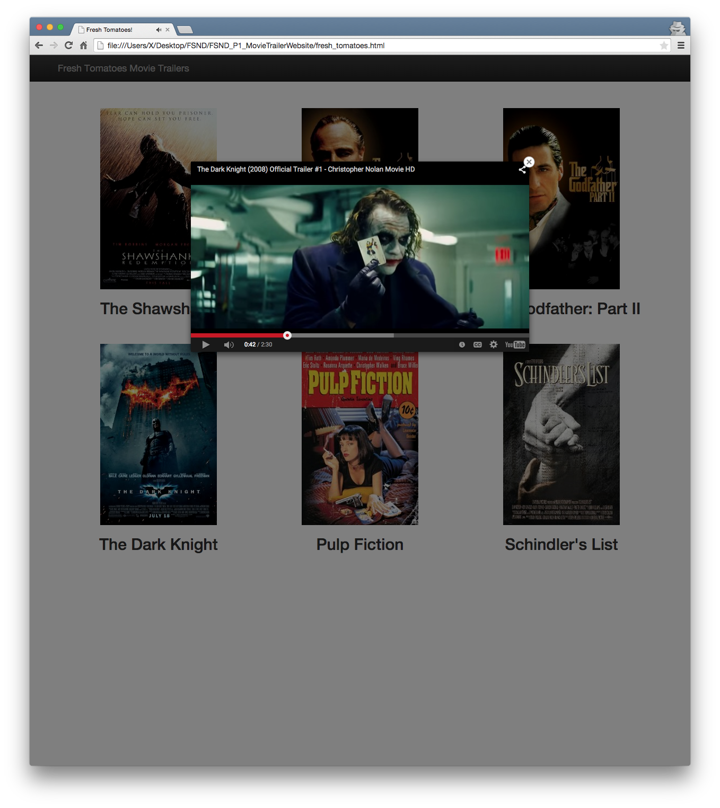

# Project Overview


Server-side code to store a list of favorite movies, including box art imagery and a movie trailer URL. Then use code to generate a static web page allowing visitors to browse their movies and watch the trailers.

## Usage

```
# Download or Clone Repository
git clone git@github.com:li-xinyang/FSND_P1_MovieTrailerWebsite.git

# Go to project directory
cd FSND_P1_MovieTrailerWebsite.git

# Start Program
python server.py
```

## Screenshot



